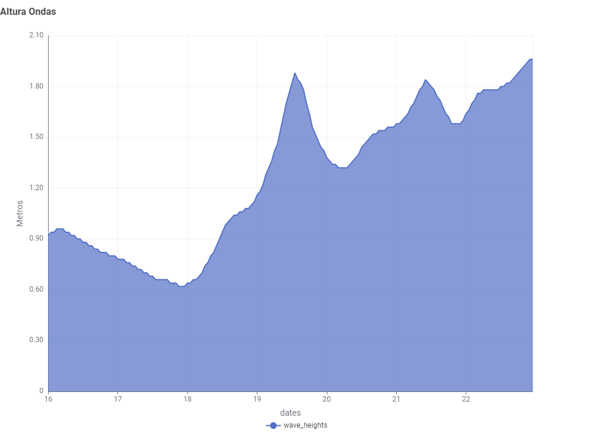

# 🌊 SurfCast – Ocean & Weather Forecast Data Processing

Integração de Sistemas de Informação

Licenciatura em Engenharia de Sistemas Informáticos (*regime pós-laboral*) 2025-26


| Número | Nome |
| -----   | ---- |
| 27990     | Pedro Alvaro Carvalho Duarte  |

## Organização

[relatório_ISI/](./relatóri_ISI/)  Pasta que contem o relatório do projeto

[surf_data/](./surf_data/)  dados recebidos da API após ser processados pelo Python

[Workflows/](./Workflows/)  Workflows para tratamento de dados, conexões à API 


## Introdução
O projeto SurfCast tem como objetivo o desenvolvimento de uma aplicação inteligente de apoio à prática do surf, baseada em dados meteorológicos e marítimos obtidos através da **Open-Meteo API**. A ferramenta visa fornecer previsões fiáveis sobre as condições do mar e do tempo, ajudando surfistas a planear as suas surf sessions.
O sistema recolhe automaticamente dados **diários** e **horários** como **altura** e **direção** das ondas, **período** de swell, velocidade e direção do **vento**, **temperatura** da superfície do mar, duração da luz solar e índice **UV**, entre outros parâmetros relevantes. A partir destas variáveis, são gerados indicadores de qualidade do surf, classificando os dias como favoráveis ou não.
Além da recolha e análise, o projeto integra também a ferramenta KNIME Analytics Platform, que permite processar, classificar e automatizar ações sobre os dados — como o envio de notificações por email aos utilizadores quando se prevê um “bom dia para surfar”. Desta forma, o SurfCast combina análise de dados, automação e comunicação inteligente num ecossistema acessível e escalável.
Este projeto integra dados meteorológicos e marítimos da **Open-Meteo API** para apoiar previsões e análises relacionadas com o **surf**.  

## Objetivo
Este projeto visa desenvolver uma solução para manipular dados metereológicos, utilizando  API's. Os dados são obtidos em e processados para extrair informações diárias e horárias como:

- Altura e direção das ondas  
- Período das ondas e ondulação  
- Temperatura da superfície do mar  
- Índice UV máximo  
- Duração do dia (daylight duration)  
- Horas de nascer e pôr do sol  

---

## Estrutura do Projeto
-   [relatório_ISI/](./SurfCast/relatóri_ISI)
            -   Documentação do projeto.
-   [surf_data/](./surf_data/)
    -   Armazena os JSON's obtidos da API junto com a database.
        -   [daily_data.json](./surf_data/daily_data.json)
            -   Registo diários.
        -   [hourly_data.json](./surf_data/hourly_data.json)
            -   Registo horário.
        -   [surfcast.db](./surf_data/surfcast.db)
            -   base de dados sql lite.
        -   [database_setup.py](./surf_data/database_setup.py)
            -   Registo horário.
-   [Workflows/](./Workflows)
        -   Contém os workflows do Knime.
-   [README.md](README.md)
        -   Arquivo que contém informações básicas sobre o projeto, a sua descrição, uso e outras instruções.
-   [main.py](main.py)
        -   Arquivo python que é o cérebro.

### Descrição da Estrutura

Este projeto está organizado de forma a separar claramente os componentes do código-fonte, dados e documentação.

Os diretórios *relatório_ISI/* e *surf_data/* contêm a o relatório do projeto e os dados obtidos pelo programa bem como a bd sql lite, respetivamente.


Já o diretório *Workflows/* contém os workflows do Knime.

##  Workflow

1. **Recolha dos dados**
    - Os dados são obtidos através de dois endpoints da Open-Meteo:

    - O endpoint abaixo conecta á api maritima e tráz variáveis Marítimas (ondas, direção, swell, etc.) e diárias (Onda máxima e Direção Dominante).  
     ```
     https://marine-api.open-meteo.com/v1/marine
     ```
    
    - O endpoint abaixo conecta á api de forecast e tráz variáveis horárias (temperatura, vento, percipitação etc.) e diárias (nascer/pôr do sol, duração do dia, UV).
     ```
     https://marine-api.open-meteo.com/v1/forecast
     ```

2. **Conversão dos dados em KNIME**
    - O JSON gerado pela API é importado para o KNIME utilizando o nó **JSON Reader**.
    - São extraídos e normalizados os campos de interesse para posterior análise e visualização.

3. **Conexão de dados no KNIME**
    - Uma conexção à API é usado através do nó **Get Request**.
    - São extraídos e normalizados os campos de interesse para posterior análise e visualização.
---
### Screenshots


*Above: Knime Workflow*



*Above: Altura das Ondas*


*Above: Campos Não Normalizados*


*Above: Campos Normalizados*


*Above: Rules*


*Above: Campos Criados pelas rules*


*Above: Exported Database*

## Conclusão

O desenvolvimento do SurfCast demonstrou o potencial das tecnologias de análise de dados e automação aplicadas a contextos desportivos e ambientais. A integração entre Python (para recolha e formatação de dados via API) e KNIME (também para recolha de dados para análise e notificação automática) permitiu criar um fluxo de trabalho robusto, reproduzível e facilmente adaptável a diferentes localizações costeiras.
Os resultados obtidos provam que é possível utilizar dados abertos, como os disponibilizados pela Open-Meteo, para gerar valor prático para comunidades locais, promovendo um surf mais informado, seguro e sustentável.
Como perspetiva futura, o projeto poderá evoluir para incluir visualizações interativas e integração com dispositivos móveis, tornando o SurfCast uma ferramenta ainda mais útil para surfistas de todos os níveis.